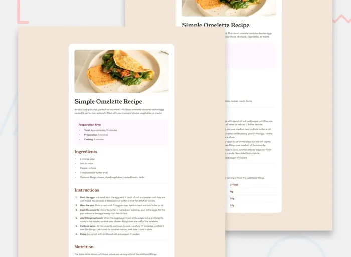

# Frontend Mentor - Recipe page - верстка і стилізація проекту головної сторінки сайту новин

Це рішення до челенджу [Recipe page](https://www.frontendmentor.io/challenges/recipe-page-KiTsR8QQKm). Завдання від Frontend Mentor допомагають покращити навички веброзробки, створюючи реалістичні проєкти.

## Зміст

- [Огляд](#огляд)
  - [Завдання](https://www.frontendmentor.io/challenges/recipe-page-KiTsR8QQKm)
  - [Скріншот](#дизайн)
  - [Посилання](#посилання)
- [Мій процес](#як-я-це-зробив)
  - [Використані технології](#застосовані-технології)
  - [Що я вивчив](#чого-я-навчився)
  - [Корисні ресурси](#корисні-ресурси)
- [Автор](#автор)
- [Подяки](#подяки)

## Огляд

### Вимоги

Користувачі повинні мати змогу:

-	Переглядати оптимальне компонування сайту відповідно до розміру екрана їхнього пристрою

-	Бачити ховер-ефекти для всіх інтерактивних елементів на сторінці

### Дизайн

### Посилання

- [Рішення URL:](https://github.com/stoneandre/super_kitchen)
- [Живий сайт URL:](https://stoneandre.github.io/super_kitchen/)

## Як я це зробив

### Застосовані технології

- Семантична HTML5 розмітка
- Flexbox
- Media-запити (max-width)

### Чого я навчився

Працюючи над цим проєктом, я поглибив свої знання у верстці та стилізації. Ось кілька основних речей, які я засвоїв:

- Адаптивний дизайн: Навчився ефективно використовувати медіа-запити для забезпечення коректного відображення сайту на різних розмірах екранів.

-	Flexbox: Закріпив розуміння розміщення елементів за допомогою цього інструменту.

-	Ховер-ефекти: Вдосконалив створення візуального зворотного зв’язку для інтерактивних елементів за допомогою псевдокласу :hover.

### Корисні джерела інформації

- [MDN-HTML](https://developer.mozilla.org/en-US/docs/Web/HTML)
- [MDN-CSS](https://developer.mozilla.org/en-US/docs/Web/CSS)

## Автор

- Мій профіль на Frontend Mentor - [@stoneandre](https://www.frontendmentor.io/profile/stoneandre)

## Подяки

Дякую ментору який мені допомагає вивчати HTML, CSS, JavaScript.
